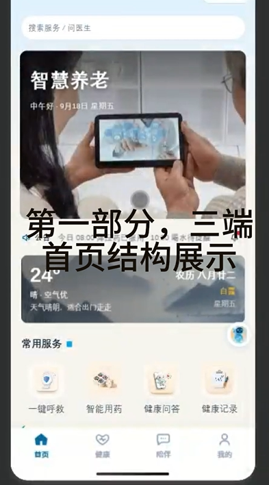

# 智慧养老微信小程序

> 面向老年人的 AI 陪伴与健康管理全栈应用，集成大模型对话、语音交互、用药提醒、跌倒检测与健康知识库。

## 🎬 演示视频

[](https://www.bilibili.com/你的视频BV号)

> 点击上方封面跳转 B 站观看完整演示（替换为你的视频链接）。

## 📱 功能截图

| 首页 | AI 陪伴聊天 | 健康管理 |
| :---: | :---: | :---: |
|  |  |  |

| 用药提醒 | 跌倒监测 | 语音交互 |
| :---: | :---: | :---: |
|  |  |  |

> 将截图放入 `screenshots/` 目录，并替换上方文件名即可。

## ✨ 核心功能

- **AI 双智能体（健康助手 + 陪伴助手）**：基于通义千问大模型，两个智能体共用同一个阿里云 DashScope API，通过 system prompt 强力约束各自角色——健康助手负责健康咨询、用药解读、指标分析；陪伴助手负责日常聊天、讲故事、情感陪伴。支持方言切换（普通话 / 四川话 / 东北话）
- **双端差异化回复策略**：健康助手针对老人端输出通俗易懂、关怀式表达，针对子女端输出专业、数据化、可执行的健康建议，通过 prompt 策略实现同一 API 的差异化输出（详见开发文档）
- **语音交互**：阿里云 CosyVoice 语音合成 + Paraformer 语音识别，支持老年人语音输入与播报
- **健康管理**：血压/血糖/心率记录与趋势分析，异常指标智能解读
- **用药提醒**：定时用药提醒与用药日志记录，支持多药品管理
- **跌倒检测**：基于 YOLO 的实时视频跌倒检测，自动触发预警通知
- **健康知识库**：RAG 检索增强生成，内置老年人健康、用药、防跌倒等专业知识
- **多角色体系**：老人端 / 子女端 / 社区服务端三端联动，紧急求助实时推送

## 🛠 技术栈

| 层级 | 技术 |
| --- | --- |
| 前端 | 微信小程序（原生 WXML / WXSS / JS） |
| 主后端 | Python + FastAPI（端口 8000） |
| 视频后端 | Python + Flask + OpenCV（端口 5001） |
| 大模型 | 阿里云 DashScope（通义千问 qwen-turbo / qwen-flash），双智能体共用同一 API，通过 prompt 约束角色 |
| 智能体架构 | 本地 Agent 工作流：function calling + 工具调用 + RAG 知识库检索，多轮对话管理 |
| 语音合成 | 阿里云 CosyVoice v3 |
| 语音识别 | 阿里云 Paraformer-realtime-v2 |
| 向量检索 | text-embedding-v4 + 本地向量存储（RAG） |
| 跌倒检测 | YOLOv8 / YOLO26n（自定义数据集训练） |
| 数据库 | SQLite + SQLAlchemy |
| 定时任务 | APScheduler |

## 📂 项目结构

```
├── qianduan/smart_elderly_care_miniprogram/   # 微信小程序前端
├── houduan/
│   ├── smart_elderly_care/                     # FastAPI 主后端（AI/健康/用药/语音）
│   ├── smart_elderly_care_backend/             # Flask 视频监控后端（跌倒检测）
│   ├── AI-daima-backend/                       # 旧版智谱 GLM 后端（未启用，仅作残留补充，主流程使用阿里云通义千问）
│   └── Fall-Down-Det/                          # YOLO 跌倒检测训练与推理
├── screenshots/                                 # 项目截图
└── 智慧养老微信小程序全栈开发文档-1.0版本.md    # 开发文档
```

## 🚀 快速开始

### 环境要求

- Python 3.8 ~ 3.10（推荐；视频后端 Flask 2.0.x 不兼容 Python 3.11+，高版本 Python 请自行升级 Flask 依赖）
- 微信开发者工具
- 阿里云百炼 API Key（大模型 / TTS / ASR / Embedding）

### 后端启动

```powershell
# 1. 安装依赖
cd houduan/smart_elderly_care
pip install -r requirements.txt

# 2. 配置 API 密钥（复制模板并填入真实 Key）
copy .env.example .env
# 编辑 .env，填入 DASHSCOPE_API_KEY

# 3. 启动主后端（端口 8000）
python main.py

# 4. 另开终端启动视频后端（端口 5001，需 OpenCV 环境）
cd ../smart_elderly_care_backend
pip install -r requirements.txt
python app.py
```

### 前端启动

1. 微信开发者工具导入 `qianduan/smart_elderly_care_miniprogram`
2. 修改 `utils/config.js` 中的 `BASE_URL` 为后端地址
3. 编译运行

## 🔑 API 密钥配置

本项目密钥通过 `.env` 文件管理，**不硬编码在源码中**。复制 `.env.example` 为 `.env` 并填入：

```env
# 阿里云百炼 DashScope（大模型 / TTS / ASR / Embedding 共用）
DASHSCOPE_API_KEY=sk-your-api-key-here
```

申请地址：[阿里云百炼控制台](https://bailian.console.aliyun.com/)

## 📄 License

MIT License
